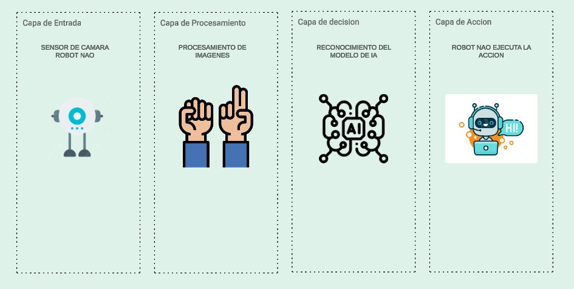

## Diagrama de Arquitectura

## Obejtivo de la implementación
El objetivo de esta implementación es desarrollar un sistema de reconocimiento de lenguaje de señas utilizando el robot NAO. El sistema será capaz de interpretar gestos específicos de lenguaje de señas a través del procesamiento de imágenes capturadas por los sensores del robot. A través del uso de un modelo de IA, el robot podrá ejecutar acciones específicas relacionadas con los gestos reconocidos. Este proyecto busca facilitar la comunicación entre personas con discapacidad auditiva y el entorno utilizando la robótica.

### 1. Capa de Entrada: Sensor de Cámara del Robot NAO
- El sensor de cámara del robot NAO captura las imágenes en tiempo real de las manos de la persona que está haciendo el lenguaje de señas. La cámara es el principal medio por el cual el robot obtiene los datos visuales que luego serán analizados.
### 2. Capa de Procesamiento: Procesamiento de Imágenes
-  Una vez capturada la imagen, se utiliza el sistema MediaPipe para detectar las manos en el cuadro de video. El marco de la mano detectada se recorta y se preprocesa, escalando la imagen a 64x64 píxeles y normalizándola para que esté lista para ser interpretada por el modelo de IA. Esto asegura que solo la región de la mano es analizada por el modelo.
### 3. Capa de Decisión: Reconocimiento del Modelo de IA
- El modelo de IA, una red neuronal convolucional (CNN), recibe la imagen preprocesada de la mano y clasifica el gesto realizado en una de las 26 letras del alfabeto (A-Z). Este modelo ha sido entrenado con imágenes de señas para reconocer los gestos correspondientes a cada letra del abecedario.
### 4. Capa de Acción: Robot NAO Ejecuta la Acción
- Tras el reconocimiento del gesto por parte del modelo de IA, la predicción de la letra (A-Z) es enviada al Robot NAO. El robot entonces usa su sistema de síntesis de voz para decir la letra reconocida en voz alta. Este flujo permite que el Robot NAO "hable" las letras que detecta a partir de los gestos de señas.
